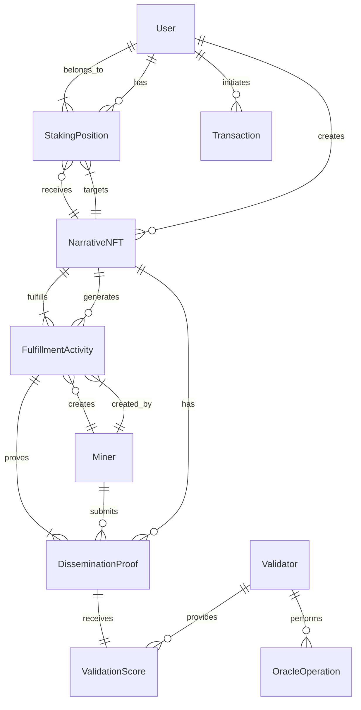

# Data Model Specification

**Feature**: Veritas Inversa (Aletheia) Website  
**Date**: 2025-09-07  
**Phase**: 1 - Design

## Entity Relationship Diagram



## Core Entities

### User
**Purpose**: Represents any wallet-connected participant in the system  
**Key Attributes**:
- `walletAddress`: string (primary key, checksummed Ethereum address)
- `ens`: string | null (ENS name if available)
- `role`: enum ['underwriter', 'validator', 'miner', 'observer']
- `reputation`: number (0-100 for validators)
- `createdAt`: timestamp
- `lastActive`: timestamp
- `settings`: jsonb (user preferences)

**Validation Rules**:
- walletAddress must be valid Ethereum address
- reputation only applicable for validators
- role can be multiple (stored as array)

### NarrativeNFT
**Purpose**: On-chain narrative concept that can be staked  
**Key Attributes**:
- `tokenId`: number (primary key, from smart contract)
- `contractAddress`: string (NFT contract address)
- `creator`: string (wallet address, foreign key to User)
- `name`: string (max 100 chars)
- `description`: text (detailed narrative)
- `tags`: string[] (searchable keywords)
- `modality`: enum ['text', 'image', 'video', 'multimodal']
- `embedding`: float[] (768-dimensional vector)
- `metadataUri`: string (IPFS URI)
- `totalStaked`: decimal (current $NARR amount)
- `uniqueStakers`: number (count of unique underwriters)
- `createdAt`: timestamp
- `lastActivity`: timestamp
- `status`: enum ['active', 'paused', 'archived']

**Validation Rules**:
- name required, unique when combined with creator
- embedding must be exactly 768 dimensions
- metadataUri must be valid IPFS URI
- totalStaked >= 0

### StakingPosition
**Purpose**: Tracks individual stakes on narratives  
**Key Attributes**:
- `id`: uuid (primary key)
- `userId`: string (foreign key to User.walletAddress)
- `narrativeId`: number (foreign key to NarrativeNFT.tokenId)
- `amount`: decimal (staked $NARR)
- `lockupPeriod`: number (days)
- `stakedAt`: timestamp
- `unlocksAt`: timestamp
- `unstaked`: boolean (default false)
- `unstakedAt`: timestamp | null
- `returns`: decimal (accumulated rewards)
- `transactionHash`: string (on-chain reference)

**Validation Rules**:
- amount > 0
- lockupPeriod >= 7 (minimum 7 days)
- unlocksAt = stakedAt + lockupPeriod
- cannot unstake before unlocksAt

### Validator
**Purpose**: Network participant who scores content  
**Key Attributes**:
- `uid`: number (primary key, Bittensor UID)
- `walletAddress`: string (foreign key to User)
- `consensusWeight`: decimal (0-1)
- `reputationScore`: decimal (0-100)
- `totalValidations`: number
- `successfulValidations`: number
- `oracleEndpoint`: string | null
- `isActive`: boolean
- `lastValidation`: timestamp
- `registeredAt`: timestamp

**Validation Rules**:
- uid unique across network
- consensusWeight between 0 and 1
- reputationScore updated by EigenTrust algorithm

### Miner
**Purpose**: Content generator and disseminator  
**Key Attributes**:
- `uid`: number (primary key, Bittensor UID)
- `walletAddress`: string (foreign key to User)
- `specialization`: enum ['text', 'image', 'video', 'multimodal']
- `performanceScore`: decimal (0-100)
- `totalGenerated`: number
- `successfulDisseminations`: number
- `rewardsEarned`: decimal
- `isActive`: boolean
- `lastActivity`: timestamp
- `registeredAt`: timestamp

**Validation Rules**:
- uid unique across network
- performanceScore calculated from validations

### FulfillmentActivity
**Purpose**: Generated content in response to narrative demand  
**Key Attributes**:
- `id`: uuid (primary key)
- `narrativeId`: number (foreign key to NarrativeNFT)
- `minerId`: number (foreign key to Miner.uid)
- `contentHash`: string (SHA-256 of content)
- `contentType`: enum ['text', 'image', 'video']
- `coherenceScore`: decimal (0-1)
- `demandScore`: decimal (0-100)
- `semanticSimilarity`: decimal (0-1)
- `generatedAt`: timestamp
- `validatedAt`: timestamp
- `validatorId`: number (foreign key to Validator.uid)

**Validation Rules**:
- coherenceScore required before demandScore
- semanticSimilarity calculated against narrative embedding

### DisseminationProof
**Purpose**: Evidence of content placement on public platforms  
**Key Attributes**:
- `id`: uuid (primary key)
- `fulfillmentId`: uuid (foreign key to FulfillmentActivity)
- `minerId`: number (foreign key to Miner.uid)
- `targetUrl`: string (where content was placed)
- `domainAuthority`: number (0-100)
- `disseminationScore`: decimal (exponential reward)
- `verified`: boolean
- `verifiedAt`: timestamp
- `duration`: number (hours content remained live)
- `transactionHash`: string (on-chain proof)

**Validation Rules**:
- targetUrl must be valid URL
- domainAuthority from SEO API
- disseminationScore = base^(domainAuthority/10)

### MarketMetrics (Time-series)
**Purpose**: Aggregated market statistics for dashboards  
**Key Attributes**:
- `timestamp`: timestamp (primary key with narrativeId)
- `narrativeId`: number (foreign key to NarrativeNFT)
- `totalStaked`: decimal
- `stakeDelta`: decimal (change since last period)
- `activeStakers`: number
- `fulfillmentCount`: number
- `disseminationCount`: number
- `averageCoherence`: decimal
- `averageDemand`: decimal

**Validation Rules**:
- Aggregated every minute
- Retained for 90 days at full resolution
- Downsampled to hourly after 7 days

### Transaction
**Purpose**: Audit trail of all financial operations  
**Key Attributes**:
- `id`: uuid (primary key)
- `userId`: string (foreign key to User)
- `type`: enum ['stake', 'unstake', 'mint', 'reward']
- `amount`: decimal
- `tokenSymbol`: string ('NARR' or 'TAO')
- `narrativeId`: number | null
- `transactionHash`: string
- `blockNumber`: number
- `status`: enum ['pending', 'confirmed', 'failed']
- `createdAt`: timestamp
- `confirmedAt`: timestamp | null

**Validation Rules**:
- transactionHash unique
- amount > 0 for all types
- status transitions: pending → confirmed/failed only

## Indexes

### Performance Indexes
```sql
-- Narrative search and filtering
CREATE INDEX idx_narrative_tags ON NarrativeNFT USING GIN(tags);
CREATE INDEX idx_narrative_modality ON NarrativeNFT(modality);
CREATE INDEX idx_narrative_status ON NarrativeNFT(status);
CREATE INDEX idx_narrative_staked ON NarrativeNFT(totalStaked DESC);

-- Staking queries
CREATE INDEX idx_staking_user ON StakingPosition(userId);
CREATE INDEX idx_staking_narrative ON StakingPosition(narrativeId);
CREATE INDEX idx_staking_unlocks ON StakingPosition(unlocksAt);

-- Activity tracking
CREATE INDEX idx_fulfillment_narrative ON FulfillmentActivity(narrativeId);
CREATE INDEX idx_fulfillment_miner ON FulfillmentActivity(minerId);
CREATE INDEX idx_dissemination_verified ON DisseminationProof(verified);

-- Time-series queries
CREATE INDEX idx_metrics_narrative_time ON MarketMetrics(narrativeId, timestamp DESC);
```

### Semantic Search Index
```sql
-- Vector similarity search using pgvector
CREATE INDEX idx_narrative_embedding ON NarrativeNFT 
USING ivfflat (embedding vector_cosine_ops)
WITH (lists = 100);
```

## State Transitions

### Staking Position States
```
Created → Locked → Unlocked → Withdrawn
         ↓
      Slashed (if penalties apply)
```

### Narrative NFT States
```
Draft → Active → Paused → Active
              ↓         ↑
           Archived
```

### Transaction States
```
Pending → Confirmed
    ↓
  Failed
```

## Data Retention Policies

- **User data**: Retained indefinitely while account active
- **Narrative NFTs**: Permanent (blockchain anchored)
- **Staking positions**: Retained 1 year after unstaking
- **Market metrics**: 90 days full resolution, then downsampled
- **Fulfillment activity**: 30 days detailed, then aggregated
- **Transaction history**: Permanent for audit trail

## Privacy Considerations

- Wallet addresses are pseudonymous
- No PII collected beyond wallet address
- IP addresses not stored
- User settings encrypted at rest
- GDPR right-to-be-forgotten via wallet disconnection

## Migration Strategy

Initial schema will be versioned as v1.0.0. Future changes will:
1. Use numbered migration files
2. Support rollback for each migration
3. Test migrations on staging first
4. Use blue-green deployment for zero downtime